<p align="center">
  
</p>

<p align="center">
  <a href="https://pypi.org/project/healthguard/"></a>
  
  
</p>

---

I'm a full stack engineer and engineering lead. I build products end to end,
architecture, delivery, and the unglamorous production details that decide
whether any of it actually ships.


<br>

## Start here: healthguard

**[healthguard](https://github.com/Arshiamk/healthguard)** is a Python library
that makes AI safer to use in healthcare apps.

Hospitals and clinics are starting to put AI chatbots in front of patients. The
problem is that an AI model can get things badly wrong — and it always sounds
confident when it does.

**Three things the AI gets wrong, and what healthguard does about each:**

| What the AI does | What healthguard does |
| --- | --- |
| Tells a patient to take **4800mg of ibuprofen a day** — the safe over-the-counter limit is 1200mg | Reads the answer before the patient sees it, flags the unsafe dose, and gives the correct limit |
| Sends the patient's **name, date of birth and NHS number** out to an external AI service | Strips those details out *before* the message ever leaves your system |
| Gets talked into ignoring your clinical safety rules by someone typing *"ignore your instructions"* | Recognises the attempt and blocks it |

To be clear about which side it sits on: **the AI model is the risk. healthguard
is the guard rail.** It sits between your app and the AI, checks what goes out
and what comes back, and records every decision it made.

```bash
pip install healthguard
```

<p align="center">
  
</p>

It works from fixed, readable rules rather than using a second AI to check the
first one. So you can see exactly why it flagged something, it adds no delay,
and it costs nothing per use.

<br>

## Open source

| Project | What it is | Built with |
| --- | --- | --- |
| **[healthguard](https://github.com/Arshiamk/healthguard)** | Safety layer for AI in healthcare apps — removes patient details, blocks prompt attacks, catches unsafe drug doses, keeps a record of every check | Python · Pydantic |
| **[fhir-flightcheck](https://github.com/Arshiamk/fhir-flightcheck)** | Checks whether a hospital data server is genuinely ready for production. Runs 35 fixed tests and produces a signed report anyone can verify | Go · PostgreSQL · NATS · Next.js |

<br>

<details>
<summary><b>Reference implementations</b> — complete, runnable builds, public so others can read them</summary>

<br>

| Project | What it is | Built with |
| --- | --- | --- |
| [autopricer](https://github.com/Arshiamk/autopricer) | Works out what price to offer for a used car, based on past sales | Python · XGBoost · FastAPI · dbt · MLflow |
| [green-grid-platform](https://github.com/Arshiamk/green-grid-platform) | Reads smart-meter data, produces bills, and forecasts energy use | Django · Celery · React · TypeScript |
| [radiopulse-platform](https://github.com/Arshiamk/radiopulse-platform) | Lets radio listeners vote and react live during a broadcast | .NET 10 · Aspire · Blazor · SignalR |
| [vue-glass-dashboard](https://github.com/Arshiamk/vue-glass-dashboard) | Admin dashboard template — charts, kanban board, calendar, login | Vue 3 · Vite · Pinia · Tailwind |
| [neon-night-racer](https://github.com/Arshiamk/neon-night-racer) | A racing game that runs in the browser with no libraries — [play it](https://arshiamk.github.io/neon-night-racer/) | Vanilla JS · HTML5 Canvas |

</details>

<details>
<summary><b>Commercial work</b> — most of my day-to-day, in private repositories</summary>

<br>

Recent and ongoing builds span pharma and biotech partner intelligence, HR and
people platforms, property and sales CRM, customer-experience tooling, and AI
advisory products — across healthcare, pharma, energy, e-commerce, automotive
and media.

Usually the same shape: software many companies use at once, systems that react
to events as they happen, AI features with real safety checks, and the automated
testing and monitoring that keep all of it running.

</details>

<br>

## Working with

**Languages**&nbsp;&nbsp;`Go`&nbsp; `TypeScript`&nbsp; `Python`&nbsp; `C# / .NET`&nbsp; `PHP`&nbsp; `SQL`

**Frontend**&nbsp;&nbsp;`React`&nbsp; `Next.js`&nbsp; `Vue 3`&nbsp; `Blazor`&nbsp; `Tailwind`

**Backend**&nbsp;&nbsp;`FastAPI`&nbsp; `Django`&nbsp; `.NET Aspire`&nbsp; `Node`&nbsp; `NATS`&nbsp; `Celery`

**Data & AI**&nbsp;&nbsp;`PostgreSQL`&nbsp; `Supabase`&nbsp; `XGBoost`&nbsp; `MLflow`&nbsp; `dbt`&nbsp; `OpenAI`&nbsp; `Anthropic`

**Platform**&nbsp;&nbsp;`Docker`&nbsp; `Kubernetes`&nbsp; `Kustomize`&nbsp; `GitHub Actions`&nbsp; `Trivy`&nbsp; `CodeQL`&nbsp; `GoReleaser`

<br>

---

<p align="center">
  <sub>
    Interested in health data standards (HL7&nbsp;/&nbsp;FHIR), keeping AI safe inside
    products people rely on,<br>and building systems that hold up in the real world.
    <br><br>
    Happy to talk about any of it — open an issue or a discussion on one of the repos.
    <br>
    <a href="https://amkcoding.co.uk">amkcoding.co.uk</a>
  </sub>
</p>
