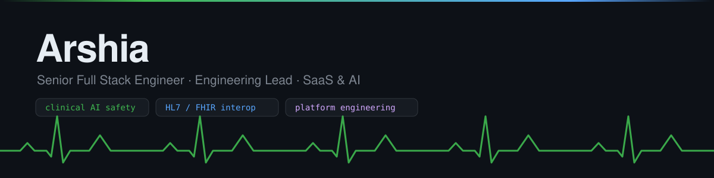

<p align="center">
  
</p>

<p align="center">
  <a href="https://pypi.org/project/healthguard/"></a>
  
  
</p>

---

I build products end to end — architecture, delivery, and the unglamorous
production details that decide whether any of it actually ships.

Right now that means **safety and readiness tooling for healthcare AI**: the
layer between a language model and a patient, and the layer between a FHIR
server and production.

<br>

## The one I'd start with

**[healthguard](https://github.com/Arshiamk/healthguard)** — clinical AI guardrails for Python.
A model in a clinical app will confidently recommend 4800mg of ibuprofen, leak
patient identifiers to a third-party API, or be talked out of your safety rules
by a prompt injection. This is the layer that catches that, in three lines.

```bash
pip install healthguard
```

<p align="center">
  
</p>

Deterministic rules, not an LLM grading another LLM — so it's inspectable, adds
no latency, and costs nothing per call.

<br>

## Open source

| Project | What it is | Stack |
| --- | --- | --- |
| **[healthguard](https://github.com/Arshiamk/healthguard)** | Clinical AI guardrails — PHI redaction, hallucination detection, prompt-injection blocking, dosage safety, audit trails | Python · Pydantic |
| **[fhir-flightcheck](https://github.com/Arshiamk/fhir-flightcheck)** | Production-readiness evaluator for FHIR R4 servers — 35 deterministic rules, Ed25519-signed reports, baseline regression gating | Go · PostgreSQL · NATS · Next.js |

<br>

<details>
<summary><b>Reference implementations</b> — complete, runnable builds, public so others can read them</summary>

<br>

| Project | What it is | Stack |
| --- | --- | --- |
| [autopricer](https://github.com/Arshiamk/autopricer) | ML pricing engine — expected-value offer optimisation | Python · XGBoost · FastAPI · dbt · MLflow |
| [green-grid-platform](https://github.com/Arshiamk/green-grid-platform) | Self-hostable energy analytics — smart-meter ingestion, billing, forecasting | Django · Celery · React · TypeScript |
| [radiopulse-platform](https://github.com/Arshiamk/radiopulse-platform) | Interactive radio engagement platform | .NET 10 · Aspire · Blazor · SignalR · ML.NET |
| [vue-glass-dashboard](https://github.com/Arshiamk/vue-glass-dashboard) | Glassmorphism admin dashboard — charts, kanban, calendar, auth | Vue 3 · Vite · Pinia · Tailwind |
| [neon-night-racer](https://github.com/Arshiamk/neon-night-racer) | Retro-futuristic pseudo-3D racer, zero dependencies — [play it](https://arshiamk.github.io/neon-night-racer/) | Vanilla JS · HTML5 Canvas |

</details>

<details>
<summary><b>Commercial work</b> — most of my day-to-day, in private repositories</summary>

<br>

Recent and ongoing builds span pharma and biotech partner intelligence, HR and
people platforms, property and sales CRM, customer-experience tooling, and AI
advisory products — across healthcare, pharma, energy, e-commerce, automotive
and media.

Common shape: multi-tenant SaaS, event-driven backends, LLM features with real
guardrails, and the CI/CD and observability to keep them running.

</details>

<br>

## Working with

**Languages**&nbsp;&nbsp;`Go`&nbsp; `TypeScript`&nbsp; `Python`&nbsp; `C# / .NET`&nbsp; `PHP`&nbsp; `SQL`

**Frontend**&nbsp;&nbsp;`React`&nbsp; `Next.js`&nbsp; `Vue 3`&nbsp; `Blazor`&nbsp; `Tailwind`

**Backend**&nbsp;&nbsp;`FastAPI`&nbsp; `Django`&nbsp; `.NET Aspire`&nbsp; `Node`&nbsp; `NATS`&nbsp; `Celery`

**Data & AI**&nbsp;&nbsp;`PostgreSQL`&nbsp; `Supabase`&nbsp; `XGBoost`&nbsp; `MLflow`&nbsp; `dbt`&nbsp; `OpenAI`&nbsp; `Anthropic`

**Platform**&nbsp;&nbsp;`Docker`&nbsp; `Kubernetes`&nbsp; `Kustomize`&nbsp; `GitHub Actions`&nbsp; `Trivy`&nbsp; `CodeQL`&nbsp; `GoReleaser`

<br>

---

<p align="center">
  <sub>
    Health-tech interoperability (HL7&nbsp;/&nbsp;FHIR) · AI product safety and human oversight ·<br>
    platform engineering that survives contact with production
    <br><br>
    Happy to talk about any of it — open an issue or a discussion on one of the repos.
  </sub>
</p>
